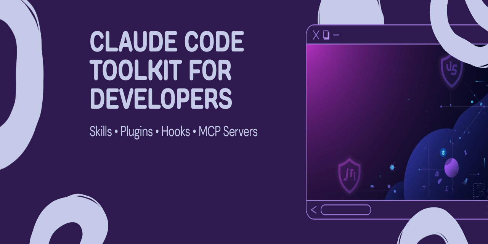

<p align="center">
  
</p>

<h1 align="center">Claude Code Toolkit</h1>

<p align="center">
  <strong>Production-tested skills, plugins, hooks, and MCP integrations for Claude Code — Anthropic's agentic coding CLI.</strong>
</p>

[](./SKILLS.md)
[](./PLUGINS.md)
[](./PLUGINS.md#mcp-servers)
[](./LICENSE)

---

## What Is This?

A curated collection of **skills, plugins, hooks, and MCP server configurations** that turn Claude Code from a smart autocomplete into a full development operations platform.

This repo documents a real-world power-user setup — including **custom-built tools** purpose-designed for gaps that existing skills don't cover.

---

## Custom-Built Tools

These are tools I built from scratch to solve real problems I kept hitting during development. Each one is battle-tested in production.

### [russian-text-quality](https://github.com/Anic888/russian-text-quality)

**Claude Code skill** — Catches Russian-language bugs that general linters and LLMs consistently miss in code.

| What it detects | Severity |
|---|---|
| Broken i18n pluralization (missing CLDR `one/few/many/other`) | Error |
| Terminology drift across locale files | Warning |
| Case-agreement bugs in string concatenation | Warning |
| Inconsistent language mixing (RU/EN) in code | Warning |
| Transliterated identifiers (`polzovatel`, `tovar`) | Info |

- Supports i18next, react-intl, vue-i18n
- Deterministic detection, no LLM guesswork
- Activation guard: only runs when Russian content is actually present
- 6 reference documents with test cases and detection algorithms

```
/russian-text-quality
```

---

### [predeploy-audit](https://github.com/Anic888/predeploy-audit-nextjs)

**Claude Code skill + CLI scanner + deploy hook** — A tiny, fast, low-noise pre-deploy security audit for vibe-coded Next.js apps.

| # | Check | Severity |
|---|---|---|
| C1 | `.env*` files tracked in git | Critical |
| C2 | `.env*` left in git history | Critical |
| C3 | Hardcoded secrets (OpenAI / Stripe / Supabase / AWS / GitHub / Google) | Critical |
| C4 | `NEXT_PUBLIC_*` variables containing secrets | Critical |
| C5 | Supabase service-role key in client-reachable code | Critical |
| C6 | Stripe webhook handler missing signature verification | Critical |
| C7 | Supabase tables without Row-Level Security | Critical |
| C8 | Vulnerable Next.js version (hosting-platform aware severity) | Critical/Low |
| C9 | `remotePatterns` wildcard SSRF surface | High |

- **~80 ms**, zero dependencies, deterministic
- Tri-state outcomes (finding / uncertain / clean) — never produces a finding it can't defend
- Hosting-platform aware: same CVE scored differently on Vercel vs Railway vs Fly.io
- Ships with regression suite (7 test fixtures) and `wobblr` demo vulnerable app
- Integrated as a **Claude Code PreToolUse hook** — auto-scans before every deploy command

```bash
node predeploy-audit.mjs /path/to/your/app
```

---

### [predeploy-audit-gate.sh](./hooks/predeploy-audit-gate.sh)

**Claude Code hook (PreToolUse)** — Automatically intercepts deploy commands (`git push main`, `vercel --prod`, `fly deploy`, `railway up`, etc.) and runs the predeploy-audit scanner before the command executes.

- Warn-only: never blocks deploys, surfaces findings in Claude's context
- Detects 8 deploy command patterns across 6 platforms
- Silent on clean scans — zero noise when everything is fine
- Disable per-session: `export PREDEPLOY_AUDIT_HOOK_DISABLED=1`

---

## Installed Skills (93+)

Full catalog with descriptions: **[SKILLS.md](./SKILLS.md)**

### By Category

| Category | Count | Highlights |
|---|---|---|
| Security & Auditing | 25+ | semgrep, codeql, owasp-security, variant-analysis, predeploy-audit |
| Fuzzing | 10+ | aflpp, libfuzzer, cargo-fuzz, atheris, ruzzy, libafl |
| Smart Contract Security | 7 | Solana, Cosmos, Cairo, TON, Algorand, Substrate scanners |
| Frontend & Design | 8 | frontend-design, ui-ux-pro-max, animate, web-design-guidelines |
| DevOps & CI/CD | 5+ | devcontainer-setup, modern-python, seatbelt-sandboxer |
| AI & Research | 5+ | deep-research, imagen, paper-search, elevenlabs |
| Code Quality | 8+ | debugging-code, second-opinion, property-based-testing |
| Blockchain | 5+ | entry-point-analyzer, token-integration-analyzer, spec-to-code-compliance |
| Productivity | 10+ | avoid-ai-writing, let-fate-decide, marketing-ideas, youtube-transcript |
| Personal & Reflection | 3 | psychologist, astrologer, cosmic-therapist |
| Creative AI | 2 | **image-studio** (custom), design-creator |
| Localization | 1 | **russian-text-quality** (custom) |

---

## Installed Plugins (17)

Full details: **[PLUGINS.md](./PLUGINS.md)**

| Plugin | What it does |
|---|---|
| **superpowers** | Plans, parallel agents, TDD, code review, brainstorming |
| **frontend-design** | Production-grade UI generation |
| **code-review** | PR review workflows |
| **security-guidance** | Security-aware coding guidance |
| **figma** | Figma design-to-code, Code Connect |
| **vercel** | Deploy, env vars, AI SDK, Next.js, shadcn/ui |
| **supabase** | Database, migrations, edge functions |
| **wix** | Site management, REST API, CLI |
| **wordpress.com** | Site builder, theme design |
| **github** | PR, issues, actions |
| **gitlab** | GitLab integration |
| **playwright** | Browser testing |
| **hookify** | Create hooks from conversation analysis |
| **skill-creator** | Build and improve custom skills |
| **ralph-loop** | Recurring task loops |
| **stripe** | Payment integrations |
| **zapier** | Workflow automation |

---

## MCP Servers (10)

| Server | Purpose |
|---|---|
| **Canva** | Design generation, editing, export |
| **Figma** | Design context, Code Connect, screenshots |
| **Hugging Face** | Model hub, Spaces, paper search |
| **Supabase** | Database, migrations, edge functions |
| **Vercel** | Deployments, logs, domains |
| **Vercel MCP** | Extended Vercel platform access |
| **Wix** | Site management, REST APIs |
| **Claude in Chrome** | Browser automation, DOM interaction |
| **Claude Preview** | Dev server preview and verification |
| **Scheduled Tasks** | Cron-based automated agents |

---

## Hook: Pre-Deploy Audit Gate

The custom `PreToolUse` hook in [`hooks/predeploy-audit-gate.sh`](./hooks/predeploy-audit-gate.sh) intercepts deploy commands and runs a security scan automatically.

### Intercepted Commands

| Platform | Command pattern |
|---|---|
| Git | `git push origin main/master` |
| Vercel | `vercel --prod`, `vercel deploy --prod` |
| Fly.io | `fly deploy`, `flyctl deploy` |
| Railway | `railway up` |
| Netlify | `netlify deploy --prod` |
| npm/pnpm/yarn | `*run deploy` |

### How to Install

```bash
# 1. Copy the hook script
cp hooks/predeploy-audit-gate.sh ~/.claude/hooks/

# 2. Add to settings.json
# (or use Claude Code's /update-config command)
```

```json
{
  "hooks": {
    "PreToolUse": [
      {
        "matcher": "Bash",
        "hooks": [
          {
            "type": "command",
            "command": "~/.claude/hooks/predeploy-audit-gate.sh"
          }
        ]
      }
    ]
  }
}
```

---

## Quick Start

### One-shot install (recommended)

The bootstrap installer registers two marketplaces (Anthropic official + Trail of Bits security skills), installs 17 official plugins + 33 Trail of Bits plugins, clones the public custom skills, and copies the deploy hook.

```bash
# macOS / Linux / WSL
git clone https://github.com/Anic888/claude-code-toolkit.git
cd claude-code-toolkit
./install.sh
```

```powershell
# Windows (PowerShell 5.1+)
git clone https://github.com/Anic888/claude-code-toolkit.git
cd claude-code-toolkit
./install.ps1
```

After it finishes:

1. Restart Claude Code so plugins load.
2. Re-authenticate MCP connectors via the claude.ai web UI (Canva, Figma, Hugging Face, Supabase, Vercel, Wix).
3. Add the predeploy-audit hook to `~/.claude/settings.json` if you want it active (snippet below).

> **Windows note:** the deploy hook is bash. For full parity, run `install.sh` inside WSL2 Ubuntu instead of the native PowerShell installer.

### Manual install (single skill or plugin)

```bash
# Custom skill
git clone https://github.com/Anic888/russian-text-quality.git
ln -s $(pwd)/russian-text-quality ~/.claude/skills/russian-text-quality

# Plugin from Anthropic marketplace
claude plugin install superpowers@claude-plugins-official

# Plugin from Trail of Bits marketplace
claude plugin marketplace add trailofbits/skills
claude plugin install firebase-apk-scanner@trailofbits
```

### Add the Deploy Hook

```bash
cp hooks/predeploy-audit-gate.sh ~/.claude/hooks/
chmod +x ~/.claude/hooks/predeploy-audit-gate.sh
# Then add the hook config to ~/.claude/settings.json (see above)
```

---

## Repository Structure

```
claude-code-toolkit/
├── README.md              # This file
├── SKILLS.md              # Full skills catalog (93+)
├── PLUGINS.md             # Plugins & MCP servers detail
├── install.sh             # Bootstrap installer for macOS / Linux / WSL
├── install.ps1            # Bootstrap installer for Windows PowerShell
├── hooks/
│   └── predeploy-audit-gate.sh   # Custom PreToolUse deploy hook
└── LICENSE
```

---

## Related Projects

| Project | Description |
|---|---|
| [russian-text-quality](https://github.com/Anic888/russian-text-quality) | Claude Code skill for Russian i18n bugs |
| [predeploy-audit-nextjs](https://github.com/Anic888/predeploy-audit-nextjs) | Pre-deploy security scanner for Next.js |

---

## Contributing

If you have a skill, plugin, or hook setup that works well with Claude Code, open an issue or PR. Particularly interested in:

- Custom skills for non-English localization
- Security-focused hooks and workflows
- Framework-specific audit tools

---

## License

MIT
