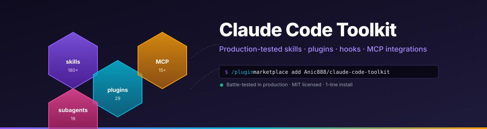
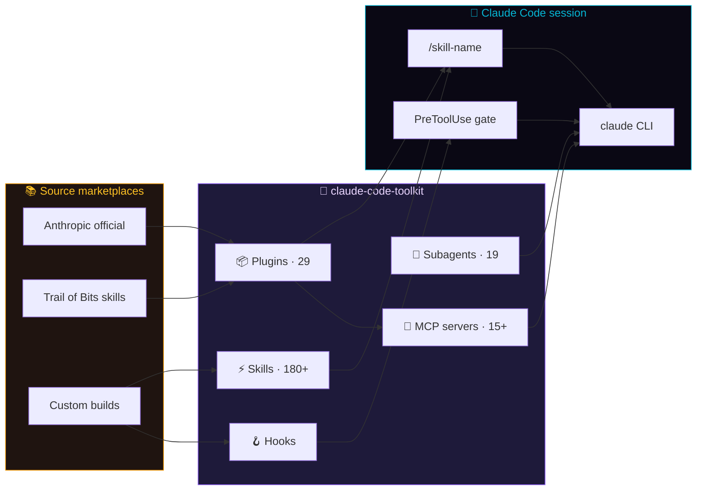
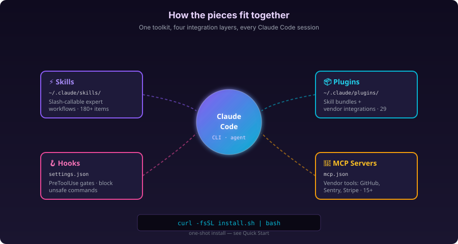
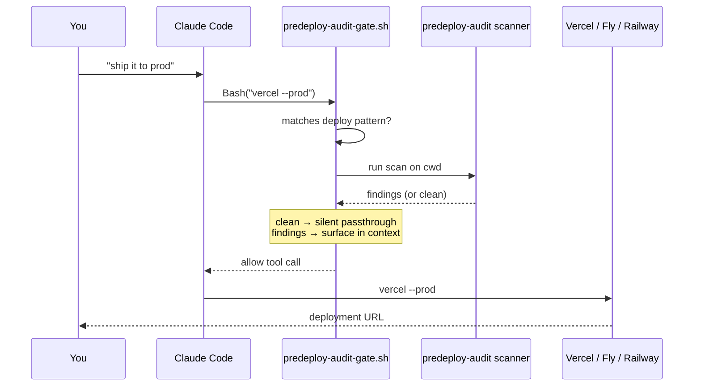

<div align="center">



[](./SKILLS.md)
[](./PLUGINS.md)
[](./SUBAGENTS.md)
[](./PLUGINS.md#mcp-servers)
[](#-quick-start)
[](./LICENSE)

**Turn Claude Code from a smart autocomplete into a full development operations platform.**

</div>

---

## Why this exists

Out of the box, Claude Code is a great agentic CLI. But to make it really earn its keep on a working stack, you need three things it doesn't ship with:

1. **Domain expertise loaded as skills** — slash-callable workflows that know your security tools, your i18n quirks, your deploy targets.
2. **Vendor integrations as plugins and MCP servers** — talking to GitHub, Supabase, Vercel, Sentry, Stripe, RevenueCat, Figma without ad-hoc shell glue.
3. **Hooks that prevent the same mistake twice** — pre-deploy gates, no-self-signed-keystore guards, no-Co-Authored-By rules — enforced by the runtime, not the model.

This repo is one engineer's real-world setup, packaged so you can adopt the whole thing in one command — or cherry-pick the parts you want.

---

## What's inside


```mermaid
flowchart LR
    subgraph Sources["📚 Source marketplaces"]
        Off[Anthropic official]
        Tob[Trail of Bits skills]
        Custom[Custom builds]
    end

    subgraph Toolkit["🧰 claude-code-toolkit"]
        Skills["⚡ Skills · 180+"]
        Plugins["📦 Plugins · 29"]
        Subagents["🤖 Subagents · 19"]
        MCP["🔌 MCP servers · 15+"]
        Hooks["🪝 Hooks"]
    end

    subgraph Runtime["🤖 Claude Code session"]
        CC[claude CLI]
        SlashCmd["/skill-name"]
        DeployGate[PreToolUse gate]
    end

    Off --> Plugins
    Tob --> Plugins
    Custom --> Skills
    Custom --> Hooks

    Skills --> SlashCmd
    Plugins --> SlashCmd
    Plugins --> MCP
    MCP --> CC
    Subagents --> CC
    Hooks --> DeployGate
    DeployGate --> CC
    SlashCmd --> CC

    style Toolkit fill:#1e1a3a,color:#e9d5ff,stroke:#8b5cf6
    style Runtime fill:#0a0814,color:#06b6d4,stroke:#06b6d4
    style Sources fill:#1f1410,color:#fbbf24,stroke:#f59e0b
```

<div align="center">
  
  <br/>
  <sub><i>The four integration layers — each independently installable.</i></sub>
</div>

| Layer | What it does | Where it lives |
|---|---|---|
| **⚡ Skills** | Slash-callable expert workflows (`/seo-audit`, `/debugging-code`, `/imagen`). Loaded on demand. | `~/.claude/skills/` |
| **📦 Plugins** | Bundles of skills + vendor MCPs + subagents (Vercel, Supabase, Sentry, Stripe…). | `~/.claude/plugins/` |
| **🪝 Hooks** | `PreToolUse` gates that block known-bad commands (e.g. unaudited deploys). | `~/.claude/settings.json` + `hooks/` |
| **🔌 MCP servers** | Live vendor APIs Claude can call: Figma, Canva, Supabase, Sentry, Stripe, Vercel, RevenueCat, PostHog… | `~/.claude/mcp.json` |
| **🤖 Subagents** | Specialized roles the main agent delegates to (whimsy-injector, design-critic, mobile-app-builder). | `~/.claude/agents/` |

---

## 🚀 Quick start

### One-shot install (recommended)

The bootstrap installer registers two marketplaces (Anthropic official + Trail of Bits security skills), installs 29 official plugins + 33 Trail of Bits plugins, clones the public custom skills, downloads the contains-studio subagents, and copies the deploy hook.

```bash
# macOS / Linux / WSL
git clone https://github.com/Anic888/claude-code-toolkit.git
cd claude-code-toolkit
./install.sh
```

```powershell
# Windows (PowerShell 5.1+)
git clone https://github.com/Anic888/claude-code-toolkit.git
cd claude-code-toolkit
./install.ps1
```

After it finishes:

1. Restart Claude Code so plugins load.
2. Re-authenticate MCP connectors via the claude.ai web UI (Canva, Figma, Hugging Face, Supabase, Vercel, Wix).
3. Add the predeploy-audit hook to `~/.claude/settings.json` if you want it active (snippet below).

> **Windows note:** the deploy hook is bash. For full parity, run `install.sh` inside WSL2 Ubuntu instead of the native PowerShell installer.

### Manual install (single skill or plugin)

```bash
# Custom skill
git clone https://github.com/Anic888/russian-text-quality.git
ln -s $(pwd)/russian-text-quality ~/.claude/skills/russian-text-quality

# Plugin from Anthropic marketplace
claude plugin install superpowers@claude-plugins-official

# Plugin from Trail of Bits marketplace
claude plugin marketplace add trailofbits/skills
claude plugin install firebase-apk-scanner@trailofbits
```

### Add the deploy hook

```bash
cp hooks/predeploy-audit-gate.sh ~/.claude/hooks/
chmod +x ~/.claude/hooks/predeploy-audit-gate.sh
# Then add the hook config to ~/.claude/settings.json (see Hook section below)
```

---

## Custom-built tools

These are tools built from scratch to solve gaps existing skills don't cover. Each one is battle-tested in production.

### [russian-text-quality](https://github.com/Anic888/russian-text-quality)

**Claude Code skill** — Catches Russian-language bugs that general linters and LLMs consistently miss in code.

| What it detects | Severity |
|---|---|
| Broken i18n pluralization (missing CLDR `one/few/many/other`) | Error |
| Terminology drift across locale files | Warning |
| Case-agreement bugs in string concatenation | Warning |
| Inconsistent language mixing (RU/EN) in code | Warning |
| Transliterated identifiers (`polzovatel`, `tovar`) | Info |

- Supports i18next, react-intl, vue-i18n
- Deterministic detection, no LLM guesswork
- Activation guard: only runs when Russian content is actually present
- 6 reference documents with test cases and detection algorithms

```
/russian-text-quality
```

### [predeploy-audit](https://github.com/Anic888/predeploy-audit-nextjs)

**Claude Code skill + CLI scanner + deploy hook** — A tiny, fast, low-noise pre-deploy security audit for vibe-coded Next.js apps.

| # | Check | Severity |
|---|---|---|
| C1 | `.env*` files tracked in git | Critical |
| C2 | `.env*` left in git history (after deletion) | Critical |
| C3 | Hardcoded OpenAI / Anthropic / Stripe / Supabase / AWS / GitHub / Google keys | Critical |
| C4 | `NEXT_PUBLIC_*` / `VITE_*` / `REACT_APP_*` variables containing secrets | Critical |
| C5 | Supabase service-role key referenced from client-reachable code | Critical |
| C6 | Stripe webhook handler missing `stripe.webhooks.constructEvent` | Critical |
| C7 | Supabase tables created without Row-Level Security | Critical |
| C8 | Vulnerable Next.js version — with hosting-platform aware severity | Critical / Low |
| C9 | `remotePatterns` wildcard `**` in `next.config.*` | High |

- **~80 ms**, zero dependencies, deterministic
- Tri-state outcomes (finding / uncertain / clean) — never produces a finding it can't defend
- Hosting-platform aware: same CVE scored differently on Vercel vs Railway vs Fly.io
- Ships with regression suite (7 test fixtures) and `wobblr` demo vulnerable app
- Integrated as a **Claude Code PreToolUse hook** — auto-scans before every deploy command

```bash
node predeploy-audit.mjs /path/to/your/app
```

### [predeploy-audit-gate.sh](./hooks/predeploy-audit-gate.sh)

**Claude Code hook (PreToolUse)** — Automatically intercepts deploy commands (`git push main`, `vercel --prod`, `fly deploy`, `railway up`, etc.) and runs the predeploy-audit scanner before the command executes.

- Warn-only: never blocks deploys, surfaces findings in Claude's context
- Detects 8 deploy command patterns across 6 platforms
- Silent on clean scans — zero noise when everything is fine
- Disable per-session: `export PREDEPLOY_AUDIT_HOOK_DISABLED=1`

---

## Installed skills (180+)

Full catalog with descriptions: **[SKILLS.md](./SKILLS.md)**

### By category

| Category | Count | Highlights |
|---|---|---|
| Security & Auditing | 25+ | semgrep, codeql, owasp-security, variant-analysis, predeploy-audit |
| Fuzzing | 10+ | aflpp, libfuzzer, cargo-fuzz, atheris, ruzzy, libafl |
| Smart Contract Security | 7 | Solana, Cosmos, Cairo, TON, Algorand, Substrate scanners |
| Frontend & Design | 8 | frontend-design, ui-ux-pro-max, animate, web-design-guidelines |
| DevOps & CI/CD | 5+ | devcontainer-setup, modern-python, seatbelt-sandboxer |
| AI & Research | 5+ | deep-research, imagen, paper-search, elevenlabs |
| Code Quality | 8+ | debugging-code, second-opinion, property-based-testing |
| Blockchain | 5+ | entry-point-analyzer, token-integration-analyzer, spec-to-code-compliance |
| Productivity | 10+ | avoid-ai-writing, let-fate-decide, marketing-ideas, youtube-transcript |
| Personal & Reflection | 3 | psychologist, astrologer, cosmic-therapist |
| Creative AI | 2 | **image-studio** (custom), design-creator |
| Localization | 1 | **russian-text-quality** (custom) |

---

## Installed plugins (29)

Full details: **[PLUGINS.md](./PLUGINS.md)**

| Plugin | What it does |
|---|---|
| **superpowers** | Plans, parallel agents, TDD, code review, brainstorming |
| **frontend-design** | Production-grade UI generation |
| **code-review** | PR review workflows |
| **security-guidance** | Security-aware coding guidance |
| **figma** | Figma design-to-code, Code Connect |
| **vercel** | Deploy, env vars, AI SDK, Next.js, shadcn/ui |
| **supabase** | Database, migrations, edge functions |
| **wix** | Site management, REST API, CLI |
| **wordpress.com** | Site builder, theme design |
| **github** | PR, issues, actions |
| **gitlab** | GitLab integration |
| **playwright** | Browser testing |
| **hookify** | Create hooks from conversation analysis |
| **skill-creator** | Build and improve custom skills |
| **ralph-loop** | Recurring task loops |
| **stripe** | Payment integrations |
| **zapier** | Workflow automation |
| **expo** | React Native + Expo mobile dev (SDK 55, EAS builds) |
| **revenuecat** | Subscription billing (iOS/Android IAP, webhooks) |
| **sentry** | Error tracking, performance monitoring |
| **posthog** | Product analytics, feature flags, session replay |
| **typescript-lsp** | TypeScript language server (strict mode, project refs) |
| **pyright-lsp** | Python type checker (uv-aware, strict mode) |
| **rust-analyzer-lsp** | Rust language server (cargo workspaces, async) |
| **swift-lsp** | Swift language server (SwiftPM, SwiftUI) |
| **commit-commands** | Git commit workflows (conventional commits, scoped) |
| **context7** | Live library docs lookup (replaces stale training data) |
| **huggingface-skills** | HF Hub, Spaces, papers, model search |

---

## Subagents (19)

Full details: **[SUBAGENTS.md](./SUBAGENTS.md)**. Subagents are specialized roles in `~/.claude/agents/` that the main agent delegates to. Lighter than skills, heavier than prompts.

| Category | Count | Highlights |
|---|---|---|
| Engineering | 3 | ai-engineer, mobile-app-builder ★, rapid-prototyper |
| Marketing | 7 | app-store-optimizer, growth-hacker, tiktok-strategist, instagram-curator, twitter-engager, reddit-community-builder, content-creator |
| Design | 7 | whimsy-injector ★, color-research, concept-explorer, design-critic, layout-verifier, periodic-research, research-agent |
| Product | 1 | trend-researcher |
| Studio Operations | 1 | legal-compliance-checker |

Most subagents come from [contains-studio/agents](https://github.com/contains-studio/agents) (MIT). The 6 design-creator agents (color-research, concept-explorer, design-critic, layout-verifier, periodic-research, research-agent) are part of the local `design-creator` skill orchestration.

★ marks agents customized for this user's stack (Astralyn / Avara / Amoris on Expo+Supabase+RC).

---

## MCP servers (15+)

| Server | Purpose |
|---|---|
| **Canva** | Design generation, editing, export |
| **Figma** | Design context, Code Connect, screenshots |
| **Hugging Face** | Model hub, Spaces, paper search |
| **Supabase** | Database, migrations, edge functions |
| **Vercel** | Deployments, logs, domains |
| **Vercel MCP** | Extended Vercel platform access |
| **Wix** | Site management, REST APIs |
| **Claude in Chrome** | Browser automation, DOM interaction |
| **Claude Preview** | Dev server preview and verification |
| **Scheduled Tasks** | Cron-based automated agents |
| **Context7** | Live library docs (replaces stale training data) |
| **PostHog** | Product analytics, feature flags, session replay queries |
| **RevenueCat** | Subscription state, customer lookups, entitlements |
| **Sentry** | Error tracking, performance issues, release tracking |
| **Stripe** | Payments, subscriptions, customer management |

---

## Hook: pre-deploy audit gate

The custom `PreToolUse` hook in [`hooks/predeploy-audit-gate.sh`](./hooks/predeploy-audit-gate.sh) intercepts deploy commands and runs a security scan automatically.


```mermaid
sequenceDiagram
    participant U as You
    participant CC as Claude Code
    participant Hook as predeploy-audit-gate.sh
    participant Scan as predeploy-audit scanner
    participant Plat as Vercel / Fly / Railway

    U->>CC: "ship it to prod"
    CC->>Hook: Bash("vercel --prod")
    Hook->>Hook: matches deploy pattern?
    Hook->>Scan: run scan on cwd
    Scan-->>Hook: findings (or clean)
    Note over Hook: clean → silent passthrough<br/>findings → surface in context
    Hook-->>CC: allow tool call
    CC->>Plat: vercel --prod
    Plat-->>U: deployment URL
```

### Intercepted commands

| Platform | Command pattern |
|---|---|
| Git | `git push origin main/master` |
| Vercel | `vercel --prod`, `vercel deploy --prod` |
| Fly.io | `fly deploy`, `flyctl deploy` |
| Railway | `railway up` |
| Netlify | `netlify deploy --prod` |
| npm/pnpm/yarn | `*run deploy` |

### How to install

```bash
# 1. Copy the hook script
cp hooks/predeploy-audit-gate.sh ~/.claude/hooks/

# 2. Add to settings.json (or use Claude Code's /update-config command)
```

```json
{
  "hooks": {
    "PreToolUse": [
      {
        "matcher": "Bash",
        "hooks": [
          {
            "type": "command",
            "command": "~/.claude/hooks/predeploy-audit-gate.sh"
          }
        ]
      }
    ]
  }
}
```

---

## Repository structure

```
claude-code-toolkit/
├── README.md              # This file
├── SKILLS.md              # Full skills catalog (180+)
├── PLUGINS.md             # 29 plugins & 15+ MCP servers detail
├── SUBAGENTS.md           # 19 subagents catalog
├── install.sh             # Bootstrap installer for macOS / Linux / WSL
├── install.ps1            # Bootstrap installer for Windows PowerShell
├── hooks/
│   └── predeploy-audit-gate.sh   # Custom PreToolUse deploy hook
├── docs/images/           # Banner and architecture diagrams
└── LICENSE
```

---

## Related projects

| Project | Description |
|---|---|
| [russian-text-quality](https://github.com/Anic888/russian-text-quality) | Claude Code skill for Russian i18n bugs |
| [predeploy-audit-nextjs](https://github.com/Anic888/predeploy-audit-nextjs) | Pre-deploy security scanner for Next.js |
| [self-improving-agents](https://github.com/Anic888/self-improving-agents) | Defensive automation: PreToolUse hooks + CVE digest + failure pattern catalog |

---

## Contributing

If you have a skill, plugin, or hook setup that works well with Claude Code, open an issue or PR. Particularly interested in:

- Custom skills for non-English localization
- Security-focused hooks and workflows
- Framework-specific audit tools

---

## License

[MIT](./LICENSE) — use it, fork it, ship it.
